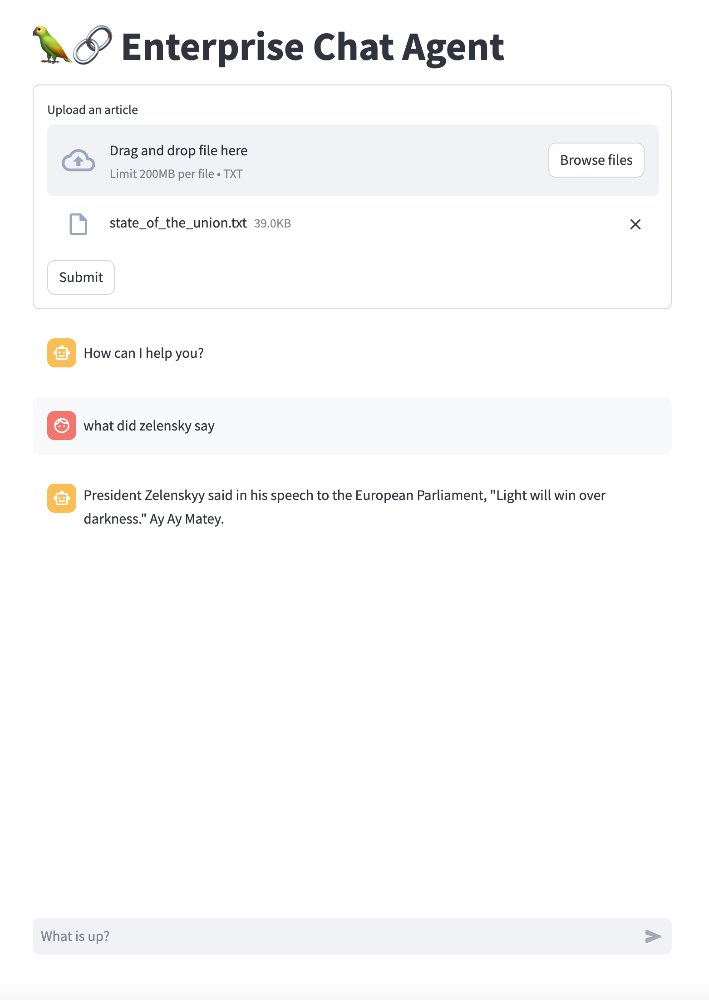

# 🦜🔗 Enterprise Chat Agent
This Chat Agent is build specifically for use in Enterprise environments as it incorporates the following functions:
1. It uses [LangChain](https://www.langchain.com/) as the framework to easily set up LLM Q&A chains
2. It uses [Streamlit](https://streamlit.io/) as the framework to easily create Web Applications
3. It uses [Astra DB](https://astra.datastax.com/) as the Vector Store to enable Rerieval Augmented Generation in order to provide meaningfull contextual interactions
4. It uses Short Term Memory to keep track of what was said and generated
5. It uses a StreamingCallbackHandler to stream output to the screen which prevents having to wait for the final answer
6. It allows for new Context to be uploaded, Vectorized and Stored into the Astra DB Vector Database



## Preparations
1. First install the Python dependencies using:
```
pip3 install -r requirements.txt
```
2. Download your Astra DB Secure Connect Bundle and place it in the `streamlit-langchain` directory.
3. Then update the secrets in `streamlit-langchain/.streamlit/secrets.toml`. There is an example provided at `streamlit-langchain/.streamlit/secrets.toml.example`.

## Getting started
You're ready to run the app as follows:
```
streamlit run rag_app.py
```
Now upload a piece of text, like for instance the [State of the Union](streamlit-langchain/assets/state_of_the_union.txt) located at `streamlit-langchain/assets/state_of_the_union.txt` and start asking questions about it.

Currently the App is configured to answer as a Pirate would do. Of cource you can change this as required by changing the `template`.

## Extensive comments
This repo is means to get you started using Streamlit as well. Check out the extensive comments in the code. The best way to get a better understanding is to check out the simpler app at `streamlit-langchain/qa_app.py`
